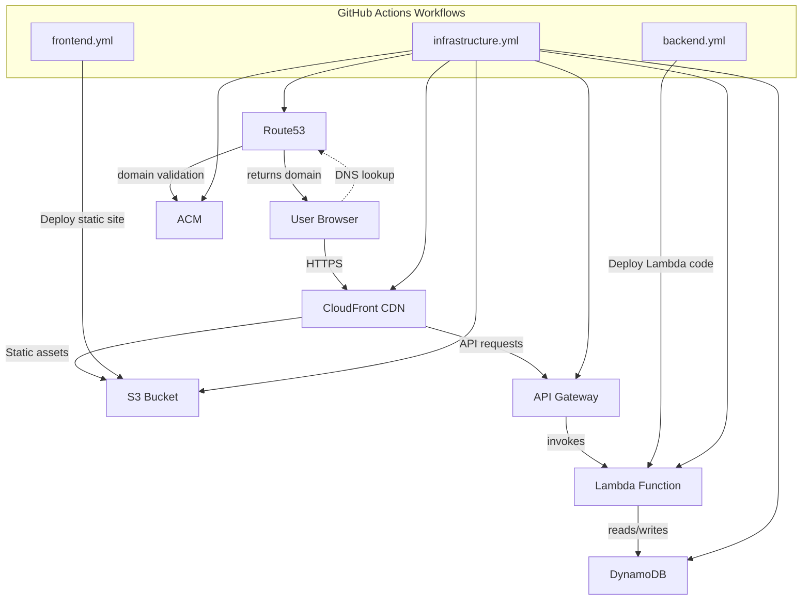

# Resume Challenge

A fully serverless resume website deployed on AWS, featuring a static frontend and a dynamic backend, all managed with Infrastructure as Code.

## Features

- **Frontend:** Static website built with React, hosted on S3, and delivered via CloudFront.
- **Backend:** AWS Lambda function behind API Gateway for dynamic features (e.g., user count).
- **Infrastructure as Code:** All AWS resources provisioned and managed using Terraform.
- **CI/CD:** Automated deployment pipelines using GitHub Actions.
- **Security:** Fine-grained IAM roles and policies, HTTPS via ACM, and DNS managed with Route 53.
- **Scalable & Cost-Effective:** Serverless architecture with pay-as-you-go AWS services.

## Architecture

- **S3:** Hosts the static frontend.
- **CloudFront:** Distributes the website globally with low latency.
- **API Gateway:** Exposes RESTful endpoints for dynamic features.
- **Lambda:** Handles backend logic (e.g., user count).
- **DynamoDB:** Stores persistent data.
- **Route 53 & ACM:** DNS management and SSL certificates.
- **Terraform:** Manages all AWS resources.
- **GitHub Actions:** CI/CD for infrastructure and application code.

---
**Link [yurii-k.xyz](https://www.yurii-k.xyz/)**
**Project by [Yurii Kycha Kolot](https://github.com/ykycha-kolot)**

